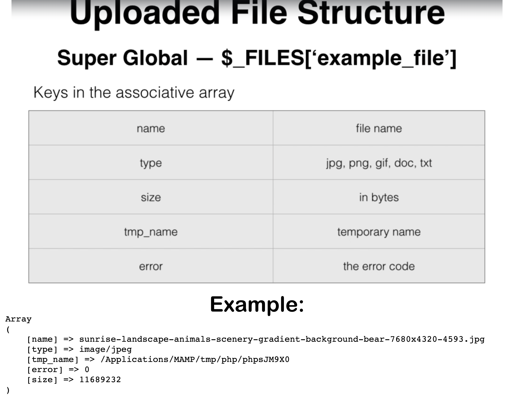
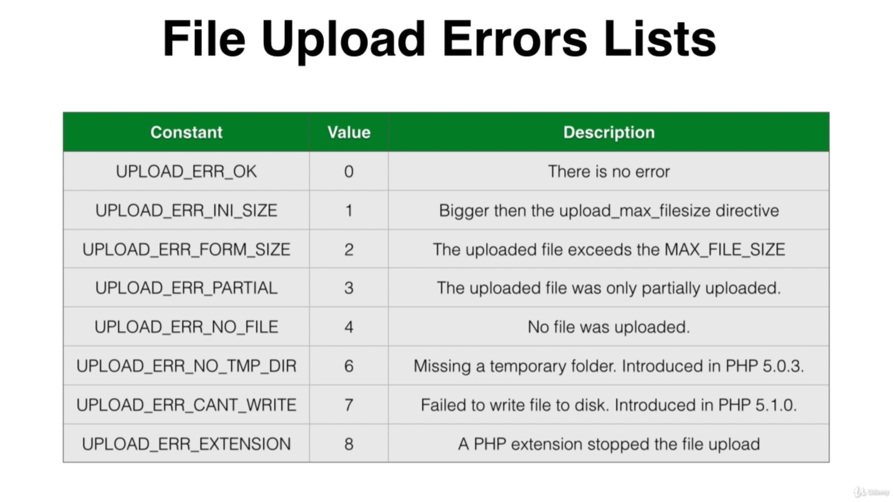

# OOP PHP Project

## Object Oriented PHP - Real World Application

---

## Difference between `require_once()` & `include()` in php

**1. `require_once():`**

-   `require_once()` is a statement used to include a file in the current PHP script. It's often used for including **essential files**, like configuration files or libraries that your script depends on.
-   **If the specified file cannot be included (e.g., file not found or a syntax error), a fatal error will occur, and the script will stop executing.**
-   It ensures that the file is included only once. If the same file has been included before, PHP won't include it again. This helps prevent issues related to redefining functions, classes, or variables.

**2. `include():`**

-   `include()` is also used to include a file in the current PHP script. It's typically used for including files that might not be crucial to the script's functionality or files that might be missing.
-   **If the specified file cannot be included, a warning will be issued, but the script will continue executing.**
-   It does not enforce inclusion only once. If the same file is included multiple times, PHP will include it every time, which might lead to redefining functions, classes, or variables.

In summary, the main differences between require_once() and include() are:

-   `require_once()` stops the script with a fatal error if the file cannot be included, while `include()` only issues a warning and continues script execution.
-   `require_once()` ensures that a file is included only once, preventing redeclaration issues. `include()` does not enforce this and might lead to multiple inclusions of the same file.
-   Choose `require_once()` for essential files that your script relies on, and use `include()` for optional files or those that might be missing without causing critical errors.

---

## trim()

In PHP, the `trim()` function is used to **remove whitespace or other specified characters from the beginning and end of a string.** This can be useful for cleaning up user inputs, such as form data, to ensure that no unwanted spaces or characters are present.

---

## Magic Constants in PHP

```
echo __FILE__ . "<br>";
echo __LINE__ . "<br>";
echo __DIR__ . "<br>";

if (file_exists(__DIR__)) {
    echo __DIR__ . " 👈 directory exists." . "<br>";
}

// Check if something is file
if (is_file(__DIR__)) {
    echo __DIR__ . " 👈 is FILE." . "<br>";
} else {
    echo "No - is is not file!, it is Directory!" . "<br>";
}

// Check if something is file
if (is_file(__FILE__)) {
    echo __FILE__ . " 👈 is FILE." . "<br>";
} else {
    echo "No - is is not file!, it is Directory!" . "<br>";
}

// Check if something is directory
if (is_dir(__DIR__)) {
    echo __DIR__ . " 👈 is DIRECTORY." . "<br>";
} else {
    echo "No - it is not DIRECTORY!" . "<br>";
}
```

---



`$_FILES` is a PHP superglobal variable that is used to retrieve information about uploaded files in a web application. When a user submits a form that includes a file upload input field, the data about the uploaded file is made available in the `$_FILES` array. This array contains several pieces of information about the uploaded file, including its name, type, temporary location, error status, and size.



---

## `mysqli_insert_id($connection)`

Returns the value generated for an AUTO_INCREMENT column by the last query.

---

## `mysqli_affected_rows($database->connection)`

Gets the number of affected rows in a previous `MySQL` operation.

-   An integer greater than zero indicates the number of rows affected or retrieved.
-   Zero indicates that no records were updated for an `UPDATE` statement, no rows matched the WHERE clause in the query or that no query has yet been executed.
-   -1 indicates that the query returned an error or that `mysqli_affected_rows was called` for an unbuffered `SELECT` query.

---

## `get_object_vars(object_name)`

Get all the properties of the given object

---

## `implode()`

-   EXPLANATION: Join array elements with a string;
-   STRUCTURE: `implode(string $separator, array $array)`

```
$array = ['lastname', 'email', 'phone'];
var_dump(implode(",", $array)); // string(20) "lastname,email,phone"
```

---

## `array_keys(array $array)`

-   EXPLANATION: array_keys — Return all the keys or a subset of the keys of an array
-   STRUCTURE: array_keys(array $array)

```
// Example 1
$array = array(0 => 100, "color" => "red");
print_r(array_keys($array));

Array
(
    [0] => 0
    [1] => color
)

// Example 2
$array = array("blue", "red", "green", "blue", "blue");
print_r(array_keys($array, "blue"));

Array
(
    [0] => 0
    [1] => 3
    [2] => 4
)
```

---

## `array_values(array $array)`

-   EXPLANATION: array_values — Return all the values of an array
-   STRUCTURE: array_values(array $array)

```
$array = array("size" => "XL", "color" => "gold");
print_r(array_values($array));

Array
(
    [0] => XL
    [1] => gold
)
```

---

## `property_exists($object_or_class, $property)`

-   EXPLANATION: property_exists — Checks if the object or class has a specific property
-   STRUCTURE: property_exists(object|string $object_or_class, string $property): bool

---

## `get_called_class()`

Gets the name of the class the static method is called in.

-   PARAMETERS: This function has no parameters.
-   RETURN VALUES: Returns the class name.

```
class foo {
    static public function test() {
        var_dump(get_called_class());
    }
}

class bar extends foo {
}

foo::test(); // "foo"
bar::test(); // "bar"
```

---

## `defined()`

-   EXPLANATION: Checks whether a given named constant exists
-   STRUCTURE: `defined(string $constant_name): bool`

```
if (defined('TEST')) {
    echo TEST;
}
```

## `define()`

-   **EXPLANATION:** Defines a named constant
-   **STRUCTURE:** `define(string $constant_name, mixed $value, bool $case_insensitive = false)`
-   **Parameters:**
    constant*name: The name of the constant.
    value: The value of the constant.
    case_insensitive: If set to true, the constant will be defined case-insensitive. \_The default behavior is case-sensitive;*

---

## `basename()`

-   **EXPLANATION:** Returns the base/trailing/final name of the given path.
-   **STRUCTURE:** `basename(string $path, string $suffix = ""): string`

```
echo "1) ".basename("/etc/sudoers.d", ".d").PHP_EOL;
echo "2) ".basename("/etc/sudoers.d").PHP_EOL;
echo "3) ".basename("/etc/passwd").PHP_EOL;
echo "4) ".basename("/etc/").PHP_EOL;
echo "5) ".basename(".").PHP_EOL;
echo "6) ".basename("/");


// RESULTS 👇
1) sudoers
2) sudoers.d
3) passwd
4) etc
5) .
6)
```

---

## `move_uploaded_file()`

-   **EXPLANATION:** Moves an uploaded file to a new location
-   **STRUCTURE:** `move_uploaded_file(string $from, string $to): bool`
-   **Parameters: **
    from: The filename of the uploaded file.
    to: The destination of the moved file.

---

## `unlink()`

-   **EXPLANATION:** Deletes filename. An E_WARNING level error will be generated on failure.
-   **STRUCTURE:** `unlink(string $filename, ?resource $context = null): bool`
-   **Parameters: **
    filename: Path to the file.
    context: A context stream resource.

---
